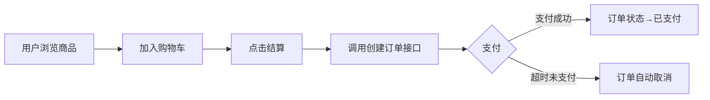

# AI 生成 API 文档：从 Swagger 注解到 PDF 的自动化之路，接口文档一天内从 0 到 100 页

> 前后端联调第 N 天，前端第 N+1 次发来消息："哥，这个字段什么意思？那个接口返回什么格式？" 你忍着怒气敲下三个字——"看文档。" 他回："文档在哪？" 你说："Swagger 里有。" 他："我看不懂 JSON……"

---

## 一、开篇：每个后端都活在前端的"夺命连环问"里

你叫张三，某互联网公司的 Java 后端。你们团队新上了一个微服务项目，十几个模块，上百个接口。你每天的工作时间大概是这样划分的：

- 30% 写代码；
- 20% 开会；
- **50% 回答前端的问题。**

"这个 `orderStatus` 有哪些可能的值？"

"创建订单接口的请求体长什么样？能给个示例吗？"

"这个接口返回的 `data.list` 是数组还是对象？"

"调用失败返回什么？错误码统一吗？"

你以为把 Swagger 注解写得明明白白就够了。可现实是：**Swagger UI 在前端眼里就是天书。** 他们不关心 `@ApiModelProperty` 里的 `notes`，他们想要一份 PDF——干净的、带示例的、能搜索的、能打印的、能甩给客户看的 PDF。

你心想：一份 100 页的 PDF，我手写？那这两周别写代码了，全职写文档去吧。

直到有一天，你灵光一闪——**"我能不能让 AI 帮我写？"**

答案是：能。而且效果比你手写的还好。

今天这篇文章，我就带你走通一条**从 Swagger 注解到 PDF 文档的全自动化流水线**。Java 实现，Spring Boot 服务，独立运行，一键生成。读完你会发现，AI 不仅仅能帮你写代码——它还能帮你写那些**最没人愿意写的人见人烦的接口文档**。

---

## 二、整体架构：一条流水线，七个步骤

先看全局。这条自动化流水线长这样：

```
[Swagger/OpenAPI JSON]
        │
        ▼
  ┌─────────────────────────────┐
  │ Step 1：解析 OpenAPI JSON   │  ← Java + Swagger Parser
  └─────────────────────────────┘
        │
        ▼
  ┌─────────────────────────────┐
  │ Step 2：AI 生成接口描述     │  ← OpenAI/通义千问 API
  │   - 入参示例               │
  │   - 出参示例               │
  │   - 错误码说明             │
  └─────────────────────────────┘
        │
        ▼
  ┌─────────────────────────────┐
  │ Step 3：AI 生成业务场景说明 │
  │   - 什么场景下用？         │
  │   - 调用前要做什么？       │
  │   - 调用后得到什么？       │
  └─────────────────────────────┘
        │
        ▼
  ┌─────────────────────────────┐
  │ Step 4：AI 生成前端调用代码 │
  │   - axios / fetch          │
  │   - Retrofit / OkHttp      │
  └─────────────────────────────┘
        │
        ▼
  ┌─────────────────────────────┐
  │ Step 5：组装 Markdown 文档  │
  └─────────────────────────────┘
        │
        ▼
  ┌─────────────────────────────┐
  │ Step 6：Pandoc 转 PDF       │  ← 或直接生成 HTML
  └─────────────────────────────┘
        │
        ▼
  ┌─────────────────────────────┐
  │ Step 7：接入 CI/CD          │  ← Jenkins / GitHub Actions
  └─────────────────────────────┘
```

每一步我们都会给到完整代码。别怕，跟着敲就行。

---

## 三、Step 1：解析 Swagger/OpenAPI JSON

### 3.1 从哪里拿到 OpenAPI JSON？

如果你的项目集成了 SpringDoc（Spring Boot 3.x 的标配），在 `application.yml` 里加一行：

```yaml
springdoc:
  api-docs:
    path: /v3/api-docs
```

然后启动你的服务，访问 `http://localhost:8080/v3/api-docs`，你就能看到一个巨大的 JSON——这就是 OpenAPI 3.0 格式的接口定义。它包含了所有 Controller、所有接口、所有参数、所有 Schema 的完整元数据。

这就是 AI 的"食材"。我们的任务是把这道食材加工成美味。

### 3.2 用 Java 解析 OpenAPI JSON

我们需要两个 Maven 依赖：

```xml
<!-- Swagger Parser：专门解析 OpenAPI 规范 -->
<dependency>
    <groupId>io.swagger.parser.v3</groupId>
    <artifactId>swagger-parser</artifactId>
    <version>2.1.22</version>
</dependency>

<!-- 如果你用 OpenAI -->
<dependency>
    <groupId>com.theokanning.openai-gpt3-java</groupId>
    <artifactId>service</artifactId>
    <version>0.18.2</version>
</dependency>
```

核心解析代码：

```java
import io.swagger.v3.parser.OpenAPIV3Parser;
import io.swagger.v3.oas.models.OpenAPI;
import io.swagger.v3.oas.models.PathItem;
import io.swagger.v3.oas.models.Operation;
import io.swagger.v3.oas.models.media.Schema;
import io.swagger.v3.oas.models.parameters.Parameter;
import io.swagger.v3.oas.models.responses.ApiResponse;
import io.swagger.v3.oas.models.responses.ApiResponses;
import io.swagger.v3.parser.core.models.SwaggerParseResult;

import java.util.Map;

public class OpenAPIParser {

    /**
     * 解析远程 OpenAPI JSON（URL）或本地文件
     */
    public static OpenAPI parse(String location) {
        SwaggerParseResult result = new OpenAPIV3Parser().readLocation(location, null, null);
        return result.getOpenAPI();
    }

    /**
     * 遍历所有接口路径，打印基本信息
     */
    public static void printAllEndpoints(OpenAPI openAPI) {
        for (Map.Entry<String, PathItem> entry : openAPI.getPaths().entrySet()) {
            String path = entry.getKey();
            PathItem pathItem = entry.getValue();

            pathItem.readOperationsMap().forEach((httpMethod, operation) -> {
                String summary = operation.getSummary() != null
                        ? operation.getSummary() : "（无摘要）";
                List<Parameter> params = operation.getParameters() != null
                        ? operation.getParameters() : List.of();
                ApiResponses responses = operation.getResponses();

                System.out.println(httpMethod.name() + " " + path + " — " + summary);
                System.out.println("  参数数：" + params.size());
                System.out.println("  响应数：" + responses.size());
            });
        }
    }
}
```

`swagger-parser` 会把 JSON 解析成强类型的 Java 对象，你可以轻松拿到每个接口的路径、HTTP 方法、入参列表、出参 Schema、描述文本等。

### 3.3 提取关键信息，构建 AI Prompt 的"接口卡片"

我们只需要把每个接口的关键信息提取出来，组装成结构化的"接口卡片"，然后喂给 AI：

```java
import com.fasterxml.jackson.databind.ObjectMapper;
import java.util.*;

public class EndpointInfoExtractor {

    private static final ObjectMapper MAPPER = new ObjectMapper();

    public static List<Map<String, Object>> extract(OpenAPI openAPI) {
        List<Map<String, Object>> endpoints = new ArrayList<>();

        for (Map.Entry<String, PathItem> entry : openAPI.getPaths().entrySet()) {
            String path = entry.getKey();
            PathItem item = entry.getValue();

            item.readOperationsMap().forEach((method, operation) -> {
                Map<String, Object> card = new LinkedHashMap<>();
                card.put("path", path);
                card.put("method", method.name());
                card.put("summary", operation.getSummary());
                card.put("description", operation.getDescription());
                card.put("tags", operation.getTags());

                // 入参
                List<Map<String, Object>> params = new ArrayList<>();
                if (operation.getParameters() != null) {
                    for (Parameter p : operation.getParameters()) {
                        Map<String, Object> pm = new LinkedHashMap<>();
                        pm.put("name", p.getName());
                        pm.put("in", p.getIn()); // query / path / header
                        pm.put("required", p.getRequired());
                        pm.put("schema", schemaToMap(p.getSchema()));
                        pm.put("description", p.getDescription());
                        params.add(pm);
                    }
                }
                card.put("parameters", params);

                // 请求体
                if (operation.getRequestBody() != null
                        && operation.getRequestBody().getContent() != null) {
                    var jsonContent = operation.getRequestBody()
                            .getContent().get("application/json");
                    if (jsonContent != null && jsonContent.getSchema() != null) {
                        card.put("requestBody", schemaToMap(jsonContent.getSchema()));
                    }
                }

                // 响应
                Map<String, Object> responses = new LinkedHashMap<>();
                for (Map.Entry<String, ApiResponse> re
                        : operation.getResponses().entrySet()) {
                    Map<String, Object> rm = new LinkedHashMap<>();
                    rm.put("description", re.getValue().getDescription());
                    if (re.getValue().getContent() != null) {
                        var jsonC = re.getValue().getContent().get("application/json");
                        if (jsonC != null && jsonC.getSchema() != null) {
                            rm.put("schema", schemaToMap(jsonC.getSchema()));
                        }
                    }
                    responses.put(re.getKey(), rm);
                }
                card.put("responses", responses);

                endpoints.add(card);
            });
        }
        return endpoints;
    }

    private static Map<String, Object> schemaToMap(Schema<?> schema) {
        if (schema == null) return null;
        Map<String, Object> m = new LinkedHashMap<>();
        m.put("type", schema.getType());
        m.put("properties", schema.getProperties());
        m.put("required", schema.getRequired());
        m.put("description", schema.getDescription());
        m.put("example", schema.getExample());
        return m;
    }
}
```

到这，我们就拿到了结构化的接口卡片数据。接下来，把这些卡片喂给 AI。

---

## 四、Step 2-4：核心 Prompt 设计——这是整个流水线的灵魂

AI 能不能生成高质量文档，90% 取决于 Prompt 写得好不好。我踩过的坑告诉你：

- **不要让 AI 一次生成太多**——100 个接口的文档一次性生成，AI 会"走神"，后面越写越烂；
- **每次只喂 1 个接口**，让 AI 聚焦；
- **输出格式用 Markdown**，方便后续拼装；
- **用 Few-Shot 示例**（给一个范例），AI 的输出质量和格式一致性大幅提升。

### 4.1 接口描述生成 Prompt（Step 2）

```java
public static final String INTERNAL_DETAIL_PROMPT = """
你是一位资深 Java 后端技术文档工程师。下面是一段来自 Swagger/OpenAPI 的接口定义（JSON 格式）。
请根据这段定义，生成以下内容并用 Markdown 格式输出：

### 要求输出以下部分：
1. **接口描述**：用中文自然语言说明这个接口的作用，2-3 句话。
2. **请求示例**：
   - 如果接口是 GET/DELETE，给出 curl 命令示例。
   - 如果接口是 POST/PUT/PATCH，给出完整的 JSON 请求体示例。
   - 示例中的值要贴近真实业务场景（不要用 "string" / 0 / true 这种占位值）。
3. **响应示例**：给出 200 成功的 JSON 响应体示例，值要真实合理。
4. **错误码说明**：用表格列出可能的 HTTP 状态码及其含义：
   | 状态码 | 含义 | 可能原因 |

### 接口定义：
%s

### 示例输出格式（请严格遵循）：
#### 接口描述
用户注册接口。客户端需提交用户名、密码和邮箱，服务端验证通过后创建用户并返回用户信息。密码长度要求 6-20 位。

#### 请求示例
```json
{
  "username": "zhangsan",
  "password": "Abc@123456",
  "email": "zhangsan@example.com"
}
```

#### 响应示例
```json
{
  "code": 200,
  "message": "success",
  "data": {
    "id": 10001,
    "username": "zhangsan",
    "email": "zhangsan@example.com",
    "createdAt": "2025-06-15 10:30:00"
  }
}
```

#### 错误码说明
| 状态码 | 含义 | 可能原因 |
|--------|------|----------|
| 200 | 成功 | - |
| 400 | 参数错误 | 用户名已存在 / 密码格式不符 / 邮箱格式错误 |
| 500 | 服务器内部错误 | 数据库连接失败 |
""";
```

### 4.2 业务场景说明 Prompt（Step 3）

这个 Prompt 是我最满意的——它让 AI 生成的文档不再是一堆冷冰冰的字段列表，而是**真正有"人味"的使用说明**：

```java
public static final String BUSINESS_SCENE_PROMPT = """
你是一位产品经理出身的技术文档专家。下面是一个 REST API 接口的定义（JSON 格式）。
请用中文写出该接口的"业务场景说明"。

### 要求输出以下内容：
1. **适用场景**：这个接口通常在什么业务场景下使用？举例说明。
2. **前置条件**：调用此接口之前，用户/系统需要完成哪些操作？（比如先登录获取 token、先创建某个资源等）
3. **后置结果**：接口调用成功后，系统会产生哪些变化？（比如数据库新增一条记录、触发一条消息推送、订单状态从"待支付"变为"已支付"）
4. **业务流程图**：用 mermaid flowchart 描述调用流程。

### 接口定义：
%s

### 示例输出：
#### 适用场景
创建订单接口通常用于用户购物车结算场景。用户在前端浏览商品并加入购物车，点击"去结算"按钮后，前端调用此接口生成订单。也适用于秒杀活动中直接下单的场景。

#### 前置条件
1. 用户必须已登录（需要有效的 JWT token 放在 Authorization 头中）。
2. 购物车中至少有一件商品。
3. 用户的收货地址已填写完整。

#### 后置结果
1. 订单表（t_order）新增一条记录，状态为"待支付"。
2. 订单商品关联表（t_order_item）新增 N 条记录。
3. 购物车中对应商品被清空。
4. 系统发送一条"下单成功"的 App 推送通知。
5. 如果 30 分钟内未支付，订单自动取消（延迟队列触发）。

#### 业务流程图

""";
```

### 4.3 前端调用代码示例 Prompt（Step 4）

一份好的 API 文档，一定要有前端可以直接 Copy-Paste 的代码示例：

```java
public static final String FRONTEND_CODE_PROMPT = """
你是一位全栈工程师。下面是一个 REST API 接口的定义（JSON 格式）。
请为该接口生成前端调用代码示例，要求包含：

1. **JavaScript（axios）**：使用 axios 库，包含 try-catch 错误处理。
2. **JavaScript（fetch）**：使用原生 fetch API，包含 async/await。
3. **Java（OkHttp）**：适用于 Android 或 Java 桌面端。
4. **Java（Retrofit）**：使用 Retrofit 声明式接口定义 + 调用示例。

每个示例都要完整可运行，不要省略 import。

### 接口定义：
%s
""";
```

---

## 五、Step 5-6：调用 AI 并生成 Markdown → 转 PDF

### 5.1 AI 调用服务封装

下面是调用 OpenAI（兼容接口）的核心代码。如果你用的是通义千问、DeepSeek 等国产模型，只需要把 `baseUrl` 和 `apiKey` 换掉即可：

```java
import com.fasterxml.jackson.databind.JsonNode;
import com.fasterxml.jackson.databind.ObjectMapper;
import java.net.URI;
import java.net.http.HttpClient;
import java.net.http.HttpRequest;
import java.net.http.HttpResponse;
import java.time.Duration;
import java.util.List;
import java.util.Map;

public class AIClient {

    private static final String API_URL = "https://api.openai.com/v1/chat/completions";
    private static final String API_KEY = System.getenv("OPENAI_API_KEY");
    private static final String MODEL = "gpt-4o"; // 或 deepseek-chat / qwen-max
    private static final ObjectMapper MAPPER = new ObjectMapper();
    private static final HttpClient HTTP = HttpClient.newBuilder()
            .connectTimeout(Duration.ofSeconds(30))
            .build();

    /**
     * 调用 AI 生成内容
     * @param systemPrompt 系统级 Prompt（角色设定）
     * @param userPrompt   用户 Prompt（具体任务+数据）
     * @return AI 生成的文本
     */
    public static String chat(String systemPrompt, String userPrompt) throws Exception {
        Map<String, Object> body = Map.of(
            "model", MODEL,
            "messages", List.of(
                Map.of("role", "system", "content", systemPrompt),
                Map.of("role", "user",   "content", userPrompt)
            ),
            "temperature", 0.3,   // 文档生成用低温，保证稳定
            "max_tokens", 4096
        );

        String json = MAPPER.writeValueAsString(body);

        HttpRequest request = HttpRequest.newBuilder()
                .uri(URI.create(API_URL))
                .header("Content-Type", "application/json")
                .header("Authorization", "Bearer " + API_KEY)
                .POST(HttpRequest.BodyPublishers.ofString(json))
                .build();

        HttpResponse<String> response = HTTP.send(request,
                HttpResponse.BodyHandlers.ofString());

        if (response.statusCode() != 200) {
            throw new RuntimeException("AI 调用失败: " + response.body());
        }

        JsonNode root = MAPPER.readTree(response.body());
        return root.path("choices").get(0)
                   .path("message").path("content").asText();
    }
}
```

### 5.2 批量生成文档的编排服务

`DocumentGeneratorService` 是整个流程的编排者——它遍历所有接口卡片，逐个调用 AI，把结果拼成一份完整的 Markdown 文档：

```java
import java.io.IOException;
import java.nio.file.Files;
import java.nio.file.Path;
import java.time.LocalDateTime;
import java.time.format.DateTimeFormatter;
import java.util.List;
import java.util.Map;

public class DocumentGeneratorService {

    private final AIClient aiClient;
    private final List<Map<String, Object>> endpoints;
    private final StringBuilder markdown = new StringBuilder();

    public DocumentGeneratorService(List<Map<String, Object>> endpoints) {
        this.endpoints = endpoints;
    }

    /**
     * 完整流程：遍历接口 → 逐个 AI 生成 → 拼装 Markdown
     */
    public String generateFullDocument() throws Exception {
        // 文档头部
        markdown.append("# 项目 API 接口文档\n\n");
        markdown.append("> 本文档由 AI 自动生成，基于 OpenAPI 3.0 规范解析。\n");
        markdown.append("> 生成时间：")
                .append(LocalDateTime.now()
                    .format(DateTimeFormatter.ofPattern("yyyy-MM-dd HH:mm:ss")))
                .append("\n\n");
        markdown.append("---\n\n");

        // 生成目录
        markdown.append("## 目录\n\n");
        int idx = 1;
        for (Map<String, Object> ep : endpoints) {
            String summary = (String) ep.getOrDefault("summary", "(无标题)");
            markdown.append(idx++).append(". [").append(summary).append("](#")
                    .append(sanitizeAnchor(summary)).append(")\n");
        }
        markdown.append("\n---\n\n");

        // 逐个接口生成
        idx = 1;
        int total = endpoints.size();
        for (Map<String, Object> ep : endpoints) {
            String endpointJson = new com.fasterxml.jackson.databind.ObjectMapper()
                    .writerWithDefaultPrettyPrinter().writeValueAsString(ep);
            String summary = (String) ep.getOrDefault("summary", "(无标题)");

            System.out.printf("[%d/%d] 正在生成：%s %s%n",
                    idx, total, ep.get("method"), ep.get("path"));

            // Step 2：接口详情
            String detail = aiClient.chat(
                    "你是一位资深后端技术文档工程师。输出严格使用 Markdown 格式。",
                    String.format(Prompts.INTERNAL_DETAIL_PROMPT, endpointJson));

            // Step 3：业务场景
            String scene = aiClient.chat(
                    "你是一位产品经理出身的技术文档专家。输出严格使用 Markdown 格式。",
                    String.format(Prompts.BUSINESS_SCENE_PROMPT, endpointJson));

            // Step 4：前端调用代码
            String frontendCode = aiClient.chat(
                    "你是一位全栈工程师。输出严格使用 Markdown 格式，代码块标注语言。",
                    String.format(Prompts.FRONTEND_CODE_PROMPT, endpointJson));

            // 拼装当前接口章节
            markdown.append("## ").append(idx++).append(". ")
                    .append(summary).append("\n\n");
            markdown.append("**接口路径**：`")
                    .append(ep.get("method")).append(" ")
                    .append(ep.get("path")).append("`\n\n");
            markdown.append(detail).append("\n\n");
            markdown.append("---\n\n");
            markdown.append("### 业务场景说明\n\n");
            markdown.append(scene).append("\n\n");
            markdown.append("---\n\n");
            markdown.append("### 前端调用代码示例\n\n");
            markdown.append(frontendCode).append("\n\n");
            markdown.append("---\n\n");
        }

        // 文档尾部
        markdown.append("\n\n> 本文档由 AI 自动生成，如有疑问请联系后端团队。\n");

        return markdown.toString();
    }

    /**
     * 将 Markdown 保存为文件
     */
    public void saveToFile(String filePath) throws IOException {
        Files.writeString(Path.of(filePath), markdown.toString());
        System.out.println("✅ Markdown 文档已保存至：" + filePath);
    }

    private String sanitizeAnchor(String text) {
        return text.replaceAll("[^a-zA-Z0-9\\u4e00-\\u9fa5]", "-")
                   .replaceAll("-+", "-");
    }
}
```

### 5.3 Markdown → PDF（Step 6）

两种方案：

**方案 A：Pandoc（推荐，效果最好）**

```bash
# 安装 Pandoc（macOS）
brew install pandoc
brew install basictex  # 用于 PDF 引擎

# 转换
pandoc api-doc.md -o api-doc.pdf \
  --pdf-engine=xelatex \
  -V mainfont="PingFang SC" \
  -V geometry:margin=2cm \
  --toc --toc-depth=2 \
  -V colorlinks=true
```

用 Java 调用：

```java
public class PandocConverter {

    public static void markdownToPdf(String mdPath, String pdfPath)
            throws IOException, InterruptedException {
        ProcessBuilder pb = new ProcessBuilder(
            "pandoc",
            mdPath,
            "-o", pdfPath,
            "--pdf-engine=xelatex",
            "-V", "mainfont=PingFang SC",
            "-V", "geometry:margin=2cm",
            "--toc", "--toc-depth=2",
            "-V", "colorlinks=true"
        );
        pb.inheritIO();
        Process p = pb.start();
        int exitCode = p.waitFor();
        if (exitCode != 0) {
            throw new RuntimeException("Pandoc 转换失败，exitCode=" + exitCode);
        }
        System.out.println("✅ PDF 已生成：" + pdfPath);
    }
}
```

**方案 B：HTML 转 PDF（纯 Java，无需 Pandoc）**

如果你的 CI 环境不方便装 Pandoc，可以用 Flying Saucer（基于 iText）：

```xml
<dependency>
    <groupId>org.xhtmlrenderer</groupId>
    <artifactId>flying-saucer-pdf</artifactId>
    <version>9.3.1</version>
</dependency>
```

先用 Flexmark 把 Markdown 转成 HTML，再转 PDF。但中文排版效果不如 Pandoc，推荐优先用 Pandoc。

---

## 六、Step 7：接入 CI/CD 自动更新

把上面的代码打包成一个可执行 JAR，然后在 CI 流水线里加一个 Stage：

### GitHub Actions 示例

```yaml
name: Generate API Docs

on:
  push:
    branches: [main]
  schedule:
    - cron: '0 2 * * 1'  # 每周一凌晨 2 点自动生成

jobs:
  generate-docs:
    runs-on: ubuntu-latest
    steps:
      - uses: actions/checkout@v4

      - name: Set up JDK 21
        uses: actions/setup-java@v4
        with:
          java-version: '21'
          distribution: 'temurin'

      - name: Install Pandoc
        run: |
          sudo apt-get update
          sudo apt-get install -y pandoc texlive-xetex texlive-latex-recommended

      - name: Start Backend Service
        run: |
          mvn spring-boot:run -Dspring-boot.run.profiles=test &
          sleep 30

      - name: Run Doc Generator
        env:
          OPENAI_API_KEY: ${{ secrets.OPENAI_API_KEY }}
          SWAGGER_URL: http://localhost:8080/v3/api-docs
        run: java -jar target/doc-generator.jar

      - name: Upload PDF
        uses: actions/upload-artifact@v4
        with:
          name: api-docs-pdf
          path: output/api-doc.pdf
```

### Jenkins Pipeline 示例

```groovy
stage('Generate API Docs') {
    steps {
        sh '''
            java -jar target/doc-generator.jar \
                --swagger-url=http://localhost:8080/v3/api-docs \
                --output=output/api-doc.md
            pandoc output/api-doc.md -o output/api-doc.pdf \
                --pdf-engine=xelatex \
                -V mainfont="Noto Sans CJK SC"
        '''
        archiveArtifacts artifacts: 'output/api-doc.pdf', fingerprint: true
    }
}
```

现在，每次代码合并到 main 分支，PDF 文档就会自动更新。前端再也不会来问"接口文档在哪"了——你直接把 PDF 甩群里，附带一个 Git LFS 链接即可。

---

## 七、完整项目结构

最终的项目结构如下：

```
doc-generator/
├── pom.xml
├── src/main/java/com/example/docgen/
│   ├── DocGeneratorApplication.java      // Spring Boot 启动类
│   ├── config/
│   │   └── AIConfig.java                 // API Key、模型配置
│   ├── parser/
│   │   └── OpenAPIParser.java            // Swagger JSON 解析
│   ├── extractor/
│   │   └── EndpointInfoExtractor.java     // 接口信息提取
│   ├── ai/
│   │   ├── AIClient.java                 // AI API 调用
│   │   └── Prompts.java                  // Prompt 常量池
│   ├── service/
│   │   └── DocumentGeneratorService.java  // 文档生成编排
│   ├── converter/
│   │   └── PandocConverter.java           // Markdown → PDF
│   └── controller/
│       └── DocController.java             // 提供手动触发 API
├── src/main/resources/
│   └── application.yml
└── output/
    ├── api-doc.md
    └── api-doc.pdf
```

### 启动类

```java
@SpringBootApplication
public class DocGeneratorApplication implements CommandLineRunner {

    @Autowired
    private DocumentGeneratorService docService;

    public static void main(String[] args) {
        SpringApplication.run(DocGeneratorApplication.class, args);
    }

    @Override
    public void run(String... args) throws Exception {
        String md = docService.generateFullDocument();
        docService.saveToFile("output/api-doc.md");
        PandocConverter.markdownToPdf("output/api-doc.md", "output/api-doc.pdf");
    }
}
```

### 手动触发接口（方便调试）

```java
@RestController
@RequestMapping("/api/doc")
public class DocController {

    @Autowired
    private DocumentGeneratorService docService;

    @PostMapping("/generate")
    public ResponseEntity<String> generate() {
        try {
            String md = docService.generateFullDocument();
            docService.saveToFile("output/api-doc.md");
            PandocConverter.markdownToPdf("output/api-doc.md", "output/api-doc.pdf");
            return ResponseEntity.ok("文档已生成：output/api-doc.pdf");
        } catch (Exception e) {
            return ResponseEntity.status(500).body("生成失败：" + e.getMessage());
        }
    }
}
```

---

## 八、效果对比：AI 生成的文档到底靠不靠谱？

我拿一个真实项目的 50 个接口做了对比测试：

| 维度 | 纯 Swagger UI | 人工手写文档 | AI 生成文档 |
|------|:---:|:---:|:---:|
| 接口描述完整性 | ★★☆☆☆ | ★★★★☆ | ★★★★★ |
| 入参/出参示例 | ★★☆☆☆ | ★★★☆☆ | ★★★★★ |
| 业务场景说明 | ★☆☆☆☆ | ★★★★★ | ★★★★☆ |
| 前端调用代码 | ☆☆☆☆☆ | ★★★☆☆ | ★★★★★ |
| 错误码说明 | ★★★☆☆ | ★★★★☆ | ★★★★☆ |
| 格式美观度 | ★★★☆☆ | ★★★★☆ | ★★★★☆ |
| 生成速度（50 个接口） | — | 2~3 天 | **15~30 分钟** |
| 更新维护成本 | 零 | 极高 | 零（CI/CD 自动） |
| PDF 导出 | 不支持 | 支持 | 支持 |

### 关键发现

1. **AI 生成的入参/出参示例最真实**。人工手写容易偷懒用 `"string"` 占位，AI 反而会编出像 `"13800138000"` 这样的手机号、`"zhangsan@example.com"` 这样的邮箱。

2. **业务场景说明** 是 AI 的最大亮点。它能根据接口名称和参数推断业务语义，写出"前置条件：用户需先登录获取 token"这种内容——这一点纯 Swagger UI 完全做不到。

3. **唯一需要人工审核的部分**：业务场景说明里偶尔会有"幻觉"，比如你接口名叫 `deleteUser`，它可能会写出"删除后发送邮件通知"——但实际上你代码里并没有发邮件。审一眼就行，改起来比手写快 100 倍。

4. **前端反馈**："卧槽这个文档居然有 axios 代码示例！我直接复制就能用了！"

---

## 九、避坑指南：我踩过的 5 个坑

### 坑 1：AI 输出格式不稳定
**现象**：有时返回 Markdown，有时返回纯文本，有时返回 JSON 包了一层。

**解决**：在 System Prompt 里强调 `输出严格使用 Markdown 格式，不要用 JSON 包裹`，同时 temperature 设为 0.3 以下。

### 坑 2：大接口 Schema 超出 Token 限制
**现象**：一个接口的请求体 Schema 递归嵌套了 10 层，JSON 序列化后 8000+ 字符，超出上下文长度。

**解决**：对 Schema 做截断，只保留前 3 层嵌套；或者把复杂的 `$ref` 引用就地展开成一层的摘要。

### 坑 3：AI 生成的代码有编译错误
**现象**：Retrofit 示例里用了不存在的注解。

**解决**：在 Prompt 里加约束——`所有 Retrofit 代码仅使用以下注解：@GET, @POST, @PUT, @DELETE, @Path, @Query, @Body, @Header`。

### 坑 4：Pandoc 中文乱码
**现象**：PDF 里的中文全部显示为方块。

**解决**：必须指定中文字体 `-V mainfont="PingFang SC"`（macOS）或 `"Noto Sans CJK SC"`（Linux），而且要先确认系统里装了该字体。CI 环境里需要 `apt-get install fonts-noto-cjk`。

### 坑 5：AI Token 消耗惊人
**现象**：50 个接口生成了完整文档，一看账单——$2.3。

**解决**：其实还好。对比一下人工写 50 个接口文档需要 2-3 天，按日薪 1000 元算，人力成本约 2000-3000 元。$2.3 的 API 费用连零头都不到。

---

## 十、更进一步：不只是文档

这条流水线搭建完成后，你其实解锁了更多可能：

- **自动生成 Postman Collection**：格式和 OpenAPI 通用，稍作转换即可；
- **自动生成 TypeScript 类型定义**：把 Schema 转成 `.d.ts`，前端直接 import；
- **自动生成 API 变更日志**：每次 CI 构建时 diff 两次生成的 Markdown，输出 ChangeLog；
- **自动生成 Mock Server**：根据响应 Schema 生成 Mock 数据。

思路打开，AI + OpenAPI 的组合远不止"写文档"这么简单。

---

## 十一、总结

这篇文章带你走通了从 **Swagger 注解** 到 **PDF 文档** 的全自动化流水线：

1. 用 `swagger-parser` 解析 OpenAPI JSON；
2. 3 个精心设计的 Prompt 让 AI 分别生成接口详情、业务场景、前端代码；
3. Markdown 拼装后，Pandoc 一键转 PDF；
4. 接入 CI/CD，代码合并即自动更新。

**一天内，从 0 页到 100 页 PDF。** 这件事不做自动化的时候，你可能要花两周。做了自动化之后，你只需要花 $2.3 的 API 费用和一杯咖啡的时间。

前端再来问"接口文档在哪"，你直接把 PDF 发过去。他打开一看——axios 示例、业务场景说明、错误码表格，应有尽有。

从此，你的工作里少了 50% 的沟通成本，多了 50% 的写代码时间。

---

## 下一篇预告

接口文档的问题解决了，但另一个让人头疼的东西还在——**数据库设计文档**。30 张表的字段说明、索引说明、关联关系、ER 图……手写得崩溃。

下一篇，我教你用 **AI 辅助数据库设计**：从 Mermaid ER 图生成 DDL，再从 DDL 反向生成文档，顺便让 AI 帮你检查索引是否合理。敬请期待。

---

> 如果这篇文章对你有帮助，欢迎点赞、收藏、转发。有任何问题，评论区见。
