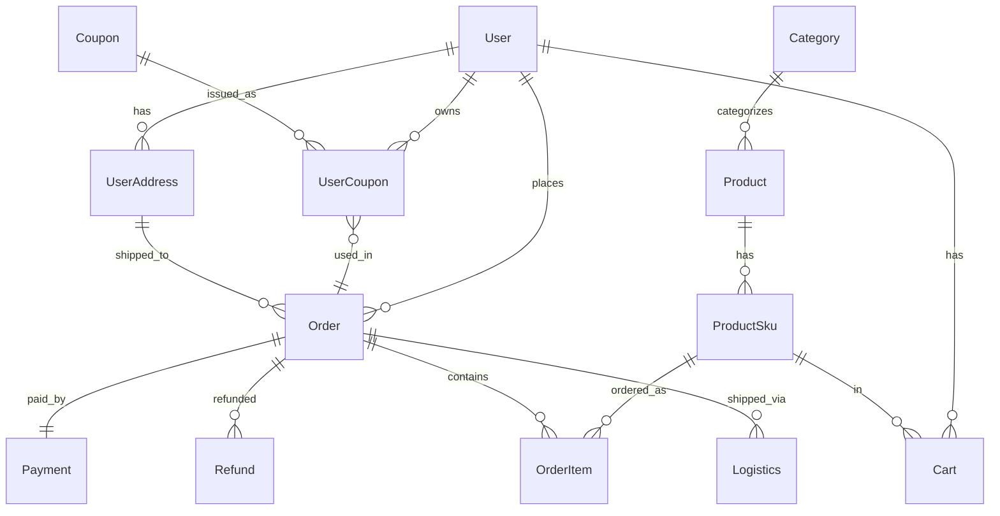

# AI 辅助数据库设计：从需求描述到 ER 图 + DDL 语句，产品经理说的"大概这样"终于能落成表结构了

> 你再也不用一边骂产品经理"需求不明确"，一边在 Navicat 里对着空白的"新建表"面板发呆了。

---

## 一、那个让你血压飙升的场景

周一早晨，你刚打开电脑，产品经理端着咖啡走过来拍了拍你的肩膀：

> "老李啊，这个功能很简单的，就做一个订单系统。用户能下单、能退款就行。画个表结构，下午评审哈。"

你内心 OS：

*"那关联的商品表呢？优惠券呢？物流呢？用户地址呢？订单状态流转呢？订单快照要不要？退款是全额还是部分？退款原因要不要分类？要不要审核流程？分库分表你考虑过没？"*

但你嘴上只能说："行，我整理一下。"

然后你打开 Navicat，对着空白的"新建表"界面，半天敲不出第一列字段名。

**这个场景，每个后端开发都经历过。**

而今天我要告诉你的是：用 AI 搞定这一切，从"大概这样"到完整的 ER 图 + DDL 语句，只需要 **15 分钟**。

---

## 二、为什么 AI 特别适合做数据库设计？

数据库设计本质上是 **"从自然语言到结构化数据模型"** 的映射过程，而大语言模型最擅长的就是这件事。

具体来说，AI 在数据库设计领域有 4 个天然优势：

| 能力 | 说明 |
|------|------|
| **实体识别** | 从需求描述中自动抽取核心业务实体（用户、订单、商品…） |
| **关系推理** | 分析实体间的关联关系（1:1、1:N、M:N） |
| **字段补全** | 根据实体名称补充常见字段（创建时间、更新时间、状态枚举…） |
| **规范遵循** | 输出约定俗成的命名规范、类型选择和索引策略 |

更重要的是，数据库设计有很多"套路"——比如电商订单表必须有 anti_seller_token、物流表必须有 tracking_number——这些 AI 学过海量开源项目后，比你记得还清楚。

---

## 三、实战：电商订单系统完整数据库设计

下面我用 **Cursor + Claude 4** 作为演示工具，但你可以换成 ChatGPT、Kimi、通义千问，**Prompt 通用**。

### 3.1 Step 1：喂需求，让 AI 分析实体关系

**Prompt（直接复制）：**

```text
你是一位资深数据库架构师。请根据以下产品需求描述，分析业务实体、
实体属性、实体间关系，输出结构化的实体关系分析报告。

## 需求描述
我们要做一个B2C电商订单系统，核心功能如下：
1. 用户可以浏览商品，将商品加入购物车
2. 用户可以下单，下单时可以：
   - 选择收货地址
   - 使用优惠券（一张订单可用一张优惠券）
   - 选择支付方式
3. 支付成功后，商家发货，用户可查看物流轨迹
4. 用户可以申请退款/退货，支持部分退款和全额退款
5. 一个订单可以包含多个商品（订单明细）
6. 订单有完整的状态流转：待支付→已支付→已发货→已完成/已取消
7. 商品有SKU概念（不同颜色/尺寸是不同SKU，价格不同）
8. 用户下单时需要保存商品快照（下单时的商品名称、价格、图片）

## 输出要求
1. 列出所有业务实体及其核心属性
2. 标注实体间关系（1:1 / 1:N / M:N）
3. 用 Mermaid ER 图语法生成 ER 图
```

**AI 输出示例（节选）：**

```text
## 实体关系分析

### 核心实体及属性

1. **用户 (User)**
   - user_id, username, phone, email, password_hash, created_at, updated_at

2. **商品 (Product)**
   - product_id, product_name, category_id, brand, description, status, created_at

3. **SKU (ProductSku)**
   - sku_id, product_id, spec_name (如"颜色:红-尺寸:M"), price, stock, sku_code

4. **购物车 (Cart)**
   - cart_id, user_id, sku_id, quantity, selected

5. **订单 (Order)**
   - order_id, order_no, user_id, total_amount, discount_amount, pay_amount,
     pay_method, order_status, address_snapshot, created_at

6. **订单明细 (OrderItem)**
   - item_id, order_id, sku_id, product_snapshot(JSON), quantity, unit_price, subtotal

7. **收货地址 (UserAddress)**
   - address_id, user_id, receiver_name, phone, province, city, district,
     detail, is_default

8. **优惠券 (Coupon)**
   - coupon_id, coupon_name, discount_type, discount_value, min_amount,
     start_time, end_time, total_quantity, used_quantity

9. **用户优惠券 (UserCoupon)**
   - user_coupon_id, user_id, coupon_id, status(未使用/已使用/已过期), used_order_id, used_time

10. **支付记录 (Payment)**
    - payment_id, order_id, pay_method, pay_amount, trade_no, pay_status, pay_time

11. **退款记录 (Refund)**
    - refund_id, order_id, refund_no, refund_type(退款/退货退款),
      refund_amount, refund_reason, refund_status, apply_time

12. **物流记录 (Logistics)**
    - logistics_id, order_id, tracking_number, carrier, status, trace_data(JSON)

### 实体间关系
- User 1:N Order
- User 1:N UserAddress
- User 1:N UserCoupon
- Order 1:N OrderItem
- Order 1:1 Payment
- Order 1:N Refund
- Order 1:N Logistics
- Product 1:N ProductSku
- Sku 1:N OrderItem
- Coupon 1:N UserCoupon
- UserCoupon N:1 Order (一张优惠券绑定一个订单)
```

**Mermaid ER 图代码（可直接渲染）：**



> 把这个 Mermaid 代码块贴到支持 Mermaid 的 Markdown 编辑器里——Typora、语雀、GitHub 都原生支持——直接就能看到渲染好的 ER 图。

---

### 3.2 Step 2：逐个生成 DDL 建表语句

拿到实体关系分析后，下一步就是生成建表语句。

**Prompt（直接复制）：**

```text
根据以下实体定义，为每个表生成完整的 MySQL DDL 建表语句，要求：
1. 使用 InnoDB 引擎，utf8mb4 字符集
2. 主键使用 BIGINT UNSIGNED AUTO_INCREMENT
3. 每个表必须包含 create_time 和 update_time 字段（DATETIME类型，有默认值）
4. 金额字段使用 DECIMAL(12,2)，不要用 FLOAT
5. 状态字段使用 TINYINT 并加 COMMENT 说明每个值的含义
6. 合理添加索引：
   - 外键字段加普通索引
   - 唯一索引加在最该加的地方（如 order_no, sku_code）
   - 考虑联合索引（如 user_id + status）
7. 所有字段都要加 COMMENT
8. 逻辑删除用 is_deleted TINYINT(1) DEFAULT 0，不用物理删除

## 需要建表的实体
- User（用户表）
- UserAddress（收货地址表）
- Category（商品分类表）
- Product（商品表）
- ProductSku（SKU表）
- Cart（购物车表）
- Order（订单表）
- OrderItem（订单明细表）
- Coupon（优惠券模板表）
- UserCoupon（用户优惠券表）
- Payment（支付记录表）
- Refund（退款记录表）
- Logistics（物流记录表）
```

**AI 生成的 DDL（节选，展示核心的 3 张表）：**

```sql
-- =============================================
-- 订单表 (orders)
-- =============================================
CREATE TABLE `orders` (
  `order_id`        BIGINT UNSIGNED NOT NULL AUTO_INCREMENT COMMENT '订单主键ID',
  `order_no`        VARCHAR(32)     NOT NULL COMMENT '订单号（展示用，全局唯一）',
  `user_id`         BIGINT UNSIGNED NOT NULL COMMENT '用户ID',
  `address_snapshot`JSON            NOT NULL COMMENT '收货地址快照（下单时的完整地址信息）',
  `total_amount`    DECIMAL(12,2)   NOT NULL DEFAULT 0.00 COMMENT '商品总金额',
  `discount_amount` DECIMAL(12,2)   NOT NULL DEFAULT 0.00 COMMENT '优惠金额',
  `pay_amount`      DECIMAL(12,2)   NOT NULL DEFAULT 0.00 COMMENT '实付金额',
  `pay_method`      TINYINT         NOT NULL DEFAULT 0 COMMENT '支付方式：1-微信 2-支付宝 3-银行卡',
  `order_status`    TINYINT         NOT NULL DEFAULT 0 COMMENT '订单状态：0-待支付 1-已支付 2-已发货 3-已完成 4-已取消 5-已退款',
  `remark`          VARCHAR(500)    DEFAULT NULL COMMENT '订单备注',
  `paid_time`       DATETIME        DEFAULT NULL COMMENT '支付时间',
  `shipped_time`    DATETIME        DEFAULT NULL COMMENT '发货时间',
  `finished_time`   DATETIME        DEFAULT NULL COMMENT '完成时间',
  `is_deleted`      TINYINT(1)      NOT NULL DEFAULT 0 COMMENT '逻辑删除：0-未删除 1-已删除',
  `create_time`     DATETIME        NOT NULL DEFAULT CURRENT_TIMESTAMP COMMENT '创建时间',
  `update_time`     DATETIME        NOT NULL DEFAULT CURRENT_TIMESTAMP ON UPDATE CURRENT_TIMESTAMP COMMENT '更新时间',
  PRIMARY KEY (`order_id`),
  UNIQUE KEY `uk_order_no` (`order_no`),
  KEY `idx_user_id` (`user_id`),
  KEY `idx_user_status` (`user_id`, `order_status`),
  KEY `idx_status_time` (`order_status`, `create_time`),
  KEY `idx_paid_time` (`paid_time`)
) ENGINE=InnoDB DEFAULT CHARSET=utf8mb4 COLLATE=utf8mb4_unicode_ci COMMENT='订单表';

-- =============================================
-- 订单明细表 (order_items)
-- =============================================
CREATE TABLE `order_items` (
  `item_id`         BIGINT UNSIGNED NOT NULL AUTO_INCREMENT COMMENT '明细主键ID',
  `order_id`        BIGINT UNSIGNED NOT NULL COMMENT '订单ID',
  `sku_id`          BIGINT UNSIGNED NOT NULL COMMENT 'SKU ID',
  `product_snapshot` JSON           NOT NULL COMMENT '商品快照（下单时的商品名称、图片、规格等）',
  `quantity`        INT UNSIGNED    NOT NULL DEFAULT 1 COMMENT '购买数量',
  `unit_price`      DECIMAL(12,2)   NOT NULL DEFAULT 0.00 COMMENT '下单时单价',
  `subtotal`        DECIMAL(12,2)   NOT NULL DEFAULT 0.00 COMMENT '小计 = unit_price * quantity',
  `create_time`     DATETIME        NOT NULL DEFAULT CURRENT_TIMESTAMP COMMENT '创建时间',
  `update_time`     DATETIME        NOT NULL DEFAULT CURRENT_TIMESTAMP ON UPDATE CURRENT_TIMESTAMP COMMENT '更新时间',
  PRIMARY KEY (`item_id`),
  KEY `idx_order_id` (`order_id`)
) ENGINE=InnoDB DEFAULT CHARSET=utf8mb4 COLLATE=utf8mb4_unicode_ci COMMENT='订单明细表';

-- =============================================
-- 退款记录表 (refunds)
-- =============================================
CREATE TABLE `refunds` (
  `refund_id`       BIGINT UNSIGNED NOT NULL AUTO_INCREMENT COMMENT '退款主键ID',
  `order_id`        BIGINT UNSIGNED NOT NULL COMMENT '关联订单ID',
  `refund_no`       VARCHAR(32)     NOT NULL COMMENT '退款单号，全局唯一',
  `refund_type`     TINYINT         NOT NULL DEFAULT 1 COMMENT '退款类型：1-仅退款 2-退货退款',
  `refund_amount`   DECIMAL(12,2)   NOT NULL DEFAULT 0.00 COMMENT '退款金额',
  `refund_reason`   VARCHAR(500)    DEFAULT NULL COMMENT '退款原因',
  `refund_status`   TINYINT         NOT NULL DEFAULT 0 COMMENT '退款状态：0-待审核 1-审核通过 2-退款中 3-已退款 4-已拒绝',
  `apply_time`      DATETIME        NOT NULL COMMENT '申请时间',
  `audit_time`      DATETIME        DEFAULT NULL COMMENT '审核时间',
  `refund_time`     DATETIME        DEFAULT NULL COMMENT '到账时间',
  `create_time`     DATETIME        NOT NULL DEFAULT CURRENT_TIMESTAMP COMMENT '创建时间',
  `update_time`     DATETIME        NOT NULL DEFAULT CURRENT_TIMESTAMP ON UPDATE CURRENT_TIMESTAMP COMMENT '更新时间',
  PRIMARY KEY (`refund_id`),
  UNIQUE KEY `uk_refund_no` (`refund_no`),
  KEY `idx_order_id` (`order_id`),
  KEY `idx_refund_status` (`refund_status`),
  KEY `idx_apply_time` (`apply_time`)
) ENGINE=InnoDB DEFAULT CHARSET=utf8mb4 COLLATE=utf8mb4_unicode_ci COMMENT='退款记录表';
```

> **全量 DDL 有 13 张表，限于篇幅不全部列出。实际使用时，AI 会在一次回复中全部生成完毕。**

---

### 3.3 Step 3：AI 生成索引优化建议

表结构有了，索引设计是关键。把这些 DDL 直接扔给 AI，让它分析：

**Prompt（直接复制）：**

```text
以下是电商订单系统的 DDL 语句，请从查询性能和业务场景角度
分析索引设计的合理性，给出优化建议。

要求：
1. 结合常见的业务查询场景（如：查询某用户所有订单、查询待支付订单、按时间范围查询退款等）
2. 指出哪些字段应该建联合索引，并说明为何是这个顺序（遵循最左前缀原则）
3. 指出哪些索引可能冗余
4. 对分库分表场景，建议 sharding key

[此处粘贴完整的DDL语句]
```

**AI 输出示例（节选）：**

```text
## 索引优化分析

### 需要添加的联合索引

1. **orders 表：`idx_user_status_time (user_id, order_status, create_time DESC)`**
   - 场景：用户查看"我的订单"时按状态筛选并按时间排序
   - 为何此顺序：user_id 区分度最高放最左，order_status 用于过滤，
     create_time 用于排序，避免 filesort

2. **refunds 表：`idx_order_status (order_id, refund_status)`**
   - 场景：查询某订单的所有退款记录并按状态筛选
   - 一个订单可能有多次退款（部分退款场景），此索引覆盖高频查询

3. **cart 表：`uk_user_sku (user_id, sku_id)`**
   - 购物车同一用户同一SKU只应有一条记录，应该用唯一索引而非普通索引
   - 查询场景就是 `WHERE user_id = ? AND sku_id = ?`，完全覆盖

### 冗余索引分析

- `orders` 表上 `idx_user_id` 和 `idx_user_status` 中前者是后者的前缀
  → 保留 `idx_user_status`，删除 `idx_user_id`（被联合索引覆盖）

### 分库分表建议

- **sharding key 选择 user_id**：
  因为 80% 的查询都是用户维度的（我的订单、我的优惠券、我的购物车）
- 订单号 order_no 建议用雪花算法生成，user_id 编码到订单号里，
  方便反查路由
```

---

### 3.4 Step 4：反向视图——从 DDL 生成数据库文档

团队里最烦的事是什么？**表结构改了，文档没更新。**

AI 可以反过来——把 DDL 扔给它，让它自动生成数据库文档：

**Prompt（直接复制）：**

```text
请根据以下 DDL 语句，生成一份结构化的数据库设计文档。

文档要求：
1. 每个表列出：表名、业务说明、字段清单（字段名/类型/是否为空/默认值/说明）
2. 列出所有索引：索引名、类型(唯一/普通/联合)、包含字段
3. 画出表间关系图（Mermaid语法）
4. 列出状态枚举值汇总表（如订单状态、退款状态、支付状态等）
5. 格式使用 Markdown，便于直接放入 wiki

[此处粘贴完整DDL]
```

这样你的数据库文档和代码就能做到 **"同源"**——表结构改了，重新跑一次 Prompt，文档自动更新。甚至可以在 CI/CD 里做个自动化步骤，每次 DDL 变更都触发 AI 重新生成文档并推送到 Wiki。

---

### 3.5 AI 生成 DDL 的优势与不足

作为负责任的博主，我不只说"AI 真厉害"，还要告诉你天花板在哪。

#### 优势

| 优势项 | 说明 |
|--------|------|
| **速度** | 13 张表的完整 DDL，AI 1 分钟生成，人工至少 1~2 小时 |
| **规范统一** | 命名风格、字段类型、注释格式全局一致，不会张三写 `create_time` 李四写 `gmt_create` |
| **不会漏字段** | AI 记性比你好，不会忘了 `create_time` 和 `update_time` |
| **索引建议有据可依** | AI 会根据查询场景给出索引建议，而不是凭感觉建索引 |
| **初学者友好** | 新人不知道该用什么字段类型、长度，AI 直接帮你填好 |

#### 需要人工修正的地方

| 不足 | 说明 | 修正方式 |
|------|------|----------|
| **不了解公司规范** | 比如你们公司要求所有表前缀 `t_`，主键统一叫 `id` 而不是 `order_id` | 在 Prompt 中明确指定命名规范 |
| **不了解业务特殊性** | 比如你们的退款必须关联到 `OrderItem` 级别而不是 `Order` 级别 | 补充业务规则到 Prompt |
| **不了解数据量级** | 单表 100 万和 1 亿的索引策略完全不同，AI 默认按中等规模处理 | 明确告知数据量级和 QPS |
| **不了解已有系统** | AI 不知道你现有的用户表已经有 `uid` 字段了，可能建出一张新的用户表 | 把现有 Schema 一起喂给 AI，让它做增量设计 |
| **过度设计倾向** | AI 有时会生成一些"看起来专业但实际用不到"的字段，比如 `last_login_ip` | 逐个审视字段，只保留业务真实需要的 |

**最佳实践：** AI 产出 → 人工 Review → 修正规范 → 团队评审 → 再让 AI 根据评审结果修改。迭代 2~3 轮得到最终版本。

---

## 四、高级玩法：给 AI 喂现有 Schema，让它当"数据库老中医"

这是最实用的场景之一：**你接手了一个老项目，数据库设计一坨翔，你想重构但无从下手。**

**Prompt（直接复制）：**

```text
你是一位数据库性能优化专家。请分析以下数据库 Schema，从以下维度
给出诊断报告和重构建议：

1. **设计问题诊断**：
   - 是否存在数据冗余（违反范式）？
   - 是否存在字段类型选择不当（如用 VARCHAR 存时间、用 FLOAT 存金额）？
   - 是否存在编码问题（如用 latin1 而不是 utf8mb4）？

2. **性能问题诊断**：
   - 是否有缺失的索引？
   - 是否有冗余索引？
   - 哪些表可能存在大表问题（字段过多、行数多）？

3. **安全隐患诊断**：
   - 是否有缺少唯一约束导致并发问题的地方？
   - 是否存在缺少 is_deleted 导致物理删除不可恢复？

4. **重构建议**：
   - 给出具体的 ALTER TABLE 语句
   - 指出哪些表需要拆表或归档
   - 给出重构步骤（如何平滑迁移，不停机）

[此处粘贴现有数据库的DDL导出]
```

**AI 诊断报告示例（节选）：**

```text
## 数据库 Schema 诊断报告

### 🔴 严重问题

1. **金额字段使用 FLOAT（orders 表 total_amount）**
   - 风险：FLOAT 有精度问题，0.1 + 0.2 ≠ 0.3
   - 修正：`ALTER TABLE orders MODIFY total_amount DECIMAL(12,2) NOT NULL DEFAULT 0.00;`

2. **缺少唯一约束（user_coupons 表）**
   - 风险：同一用户可能领到多张相同优惠券（接口没做幂等时）
   - 修正：`ALTER TABLE user_coupons ADD UNIQUE KEY uk_user_coupon (user_id, coupon_id);`

3. **索引缺失（payments 表没有 order_id 索引）**
   - 影响：每次通过订单查支付记录都是全表扫描
   - 修正：`ALTER TABLE payments ADD INDEX idx_order_id (order_id);`

### 🟡 一般问题

4. **user 表字段过多（42 个字段）**
   - 建议：拆出 `user_profiles` 表存放不常用字段
   - 拆分后冷热数据分离，减少 InnoDB 行溢出

### 🟢 优化建议

5. **物流表 logistics 的 trace_data 列建议迁移到独立表**
   - JSON 列不适合频繁更新，建议建 `logistics_traces` 表按时间序列存储
```

这种诊断报告拿去给 Leader 看，逼格拉满。

---

## 五、工具推荐：除了通用 AI，还有哪些专用工具？

| 工具 | 特点 | 适用场景 |
|------|------|----------|
| **Cursor / Copilot** | 通用 AI 编程助手，Prompt 驱动 | 日常开发，灵活度最高 |
| **ChatGPT / Claude** | 大语言模型，长上下文 | 复杂 Schema 分析、文档生成 |
| **dbdiagram.io** | 在线数据库设计 + DSL，可导出 DDL | 快速画 ER 图，团队共享 |
| **DrawSQL** | 专业的数据库设计工具，可视化 ER 图 | 设计评审时展示，支持团队协作 |
| **Navicat Data Modeler** | 桌面端数据库建模，正向/反向工程 | 重型项目，需要版本管理 |
| **DBSchema** | 多数据库支持，可视化建模 + 同步 | 异构数据库环境 |
| **MySQL Workbench** | 官方免费工具，建模 + DDL 同步 | MySQL 专属，功能和性能均衡 |
| **Yearning** | 开源的 SQL 审核平台 | 已上线系统的 DDL 变更审批 |
| **Skeema** | 纯 SQL 的 Schema 变更管理工具 | CI/CD 集成，GitOps 模式管理表结构 |

> dbdiagram.io 特别推荐——它的 DSL 语法和 AI 生成的结构化实体描述非常接近，你甚至可以让 AI 直接生成 dbdiagram DSL，然后一键导入渲染。

---

## 六、Prompt 模板大汇总

把上面的精华提炼成三个"一劳永逸"的模板，收藏起来随用随取：

### 模板 1：从零设计

```text
你是一位资深数据库架构师。请根据以下需求设计数据库：

[粘贴产品需求文档]

要求：输出实体关系分析 + Mermaid ER 图 + 完整 MySQL DDL + 索引建议。
项目命名规范：[说明你的规范，如：表名 t_前缀，字段全小写下划线，主键统一用 id]
```

### 模板 2：增量修改

```text
现有数据库 Schema 如下：

[粘贴现有 DDL]

现在要新增以下功能：[描述新需求]
请给出：新增表/修改表的 DDL，以及是否有现有表需要调整。
```

### 模板 3：诊断审查

```text
请审查以下数据库 Schema：[粘贴 DDL]
从设计规范性、性能、安全三个维度给出诊断报告和具体修复 SQL。
```

---

## 七、写在最后

数据库设计这件事，过去靠的是"经验"——你踩过的坑越多，设计的表就越靠谱。但现在 AI 相当于帮你把整个 GitHub 上有经验的开发者的知识都凝聚到了一起。

这意味着什么？

- **初级开发** 也能设计出 80 分的表结构（剩下的 20 分靠经验补）
- **高级开发** 从"设计表结构"升级到"审查 AI 产出 + 补充业务特化逻辑"
- **团队** 的数据库设计有了一个统一的"标尺"——AI 第一次生成的版本就是 baseline

当然，AI 不是银弹。它给不了你分库分表的具体策略（因为这和你的 QPS、数据量、团队运维能力有关），也给不了你符合公司内部规范命名的字段（你需要在 Prompt 里说清楚）。但它能帮你跳过"新建一张空表，扣着脑袋想字段"的痛苦阶段，直接进入"审查和优化"阶段。

**这已经是一个巨大的效率飞跃了。**

---

### 📖 本系列导航

| 序号 | 标题 | 状态 |
|------|------|------|
| 001 | GitHub Copilot 从入门到精通 | ✅ 已发布 |
| 002 | Copilot Chat 实战：用自然语言重构遗留 Java 代码 | ✅ 已发布 |
| 003 | 利用 Copilot 自动生成单元测试 | ✅ 已发布 |
| 004 | Copilot + MyBatis 一键生成 Mapper XML 与复杂 SQL | ✅ 已发布 |
| 005 | Copilot 多模块 Maven 项目中的上下文管理技巧 | ✅ 已发布 |
| 006 | Copilot 生成代码的 Code Review 清单 | ✅ 已发布 |
| 007 | Cursor 全面评测 | ✅ 已发布 |
| 008 | Cursor Rules for Java | ✅ 已发布 |
| 009 | Cursor + SpringBoot 从零生成 RESTful CRUD | ✅ 已发布 |
| 010 | Cursor Composer 模式：多文件联动修改 | ✅ 已发布 |
| 011 | Cursor 与 IntelliJ IDEA AI Assistant 横向对比 | ✅ 已发布 |
| 012 | AI 辅助 Code Review：GitHub Actions + GPT 自动化审查 | ✅ 已发布 |
| 013 | AI 生成 API 文档：从 Swagger 注解到 PDF | ✅ 已发布 |
| **014** | **AI 辅助数据库设计：从需求描述到 ER 图 + DDL** | 👈 本篇 |
| 015 | AI 辅助正则表达式编写 | 🔜 下一篇 |

---

> **下一篇预告：** `015-AI辅助正则表达式编写` —— "帮我写一个验证手机号的正则"，这可能是程序员问 AI 频率最高的一句话。但你知道吗，AI 还能帮你反编译正则、解释已有正则含义、把通配符翻译成正则表达式。下篇我们彻底终结"正则恐惧症"。

---

*如果觉得有用，欢迎点赞、收藏、转发。有任何 AI 编程相关的问题，评论区留言，我会逐条回复。*
