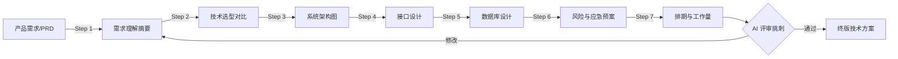
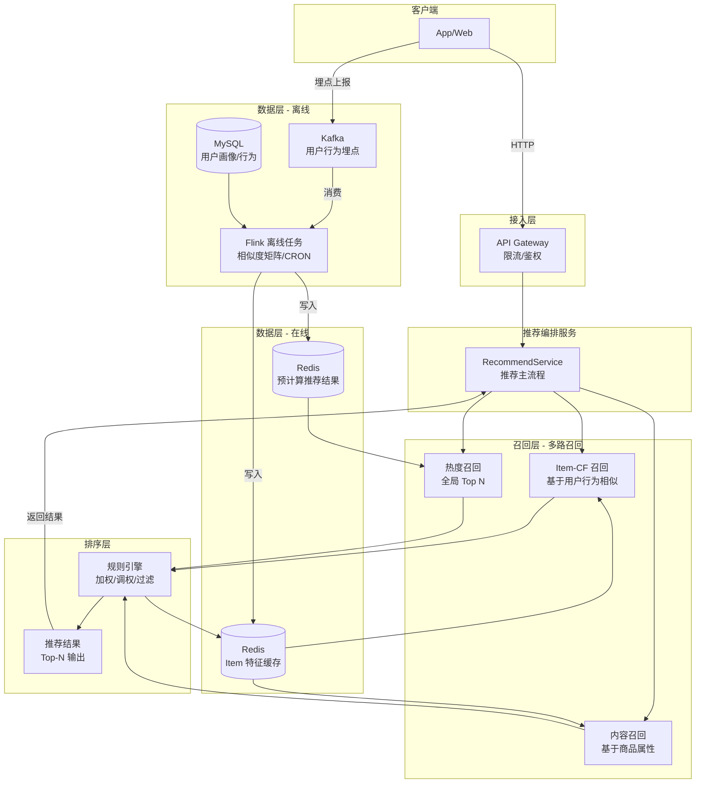
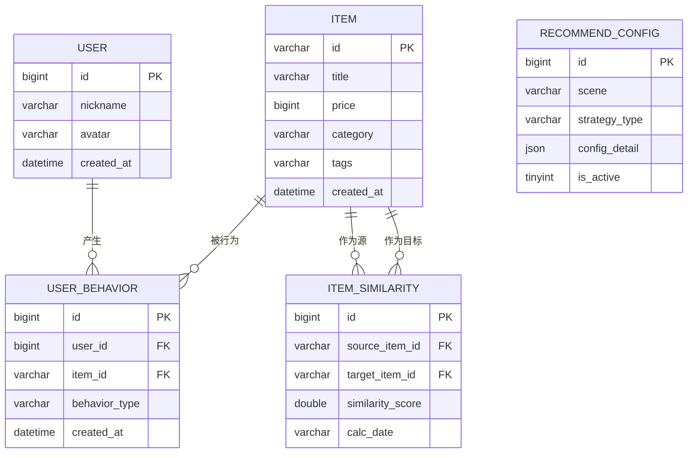
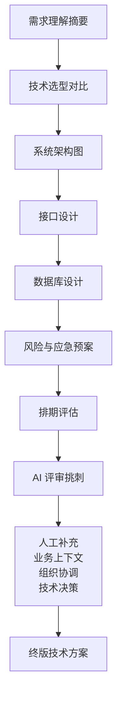

# AI 辅助技术方案编写：从"产品说要做个推荐系统"到一份合格的技术设计文档，提效 80%

> 周五下午 5 点，产品经理弹窗："下周能出个推荐系统的技术方案吗？老板很重视。"你盯着屏幕上刚改完的 CRUD 代码，内心 OS：*推荐系统？协同过滤？召回排序？我只写过用户表的增删改查啊...* 打开 Google 搜索"How to design a recommendation system"，页面加载中，你已经开始盘算周末要加几个班了。

<center></center>

如果你有过上述经历——放心，你不是一个人。技术方案编写是高级工程师的日常，也是初中级工程师最"劝退"的环节。

但今天，我要分享一套 **AI 辅助技术方案编写 Pipeline**，从一个只有 3 句话的原始需求出发，7 步产出合格的技术设计文档，**总体提效 80%**。

---

## 一、先看效果：人机协作的完整 Pipeline



**核心思路**：不是让 AI 替你写方案，而是 AI 做 80% 的"初稿生成"，你做 20% 的"校准润色"——懂行的老手省下敲字时间，不熟领域的新手得到一份不会偏航的导航图。

下面我以"电商推荐系统"为例，逐步演示。

---

## 二、Step 1：需求理解摘要

### 2.1 为什么先做这一步

90% 的技术方案翻车，不是因为架构画得不够漂亮，而是**从一开始就没理解清楚产品到底要什么**。AI 在这一步的价值是：把你的原始话翻译成结构化的技术需求描述，暴露出模糊点，让你回去找产品确认。

### 2.2 原始需求（产品发来的）

产品发来的是一个飞书消息，3 句话：

```
我们要做一个商品推荐系统，首页和商品详情页都要有推荐位。
首页是"猜你喜欢"，详情页是"看了又看"。
用户量大概 10 万 DAU，商品 5 万个。下周能出技术方案吗？
```

### 2.3 Prompt

```
你是某电商平台的技术负责人。请阅读以下产品需求，输出一份"需求技术化摘要"：

1. 用 3-5 个要点，用技术语言表述这个需求具体要做什么。
2. NFR（非功能需求）：推测出性能、可用性、数据一致性等方面的要求，标注"待确认"。
3. 指出需求中没说清楚的关键点（需求缺口），每个缺口用一句话说明影响。

需求如下：
---
我们要做一个商品推荐系统，首页和商品详情页都要有推荐位。
首页是"猜你喜欢"，详情页是"看了又看"。
用户量大概 10 万 DAU，商品 5 万个。
---
```

### 2.4 AI 输出示例

> **需求技术化摘要**
>
> **1. 功能要点**
> - 首页"猜你喜欢"推荐位：根据用户历史行为（浏览、加购、购买）计算个性化推荐结果，需要接入用户行为埋点数据。
> - 商品详情页"看了又看"推荐位：基于当前商品的属性相似度或关联规则，返回 top-N 相似商品。
> - 冷启动策略：新用户无历史行为时需返回默认/热门商品列表。
>
> **2. NFR（非功能需求）**
> - 接口响应时间：推荐接口 P99 < 200ms（**待确认**），首页为高流量入口。
> - QPS 预估：10 万 DAU，按 10% 同时在线，人均 5 次请求估算——峰值 QPS ≈ 5000（**待确认**）。
> - 数据新鲜度：用户行为发生后多久影响推荐结果？推测 T+1（**待确认**）。
> - 可用性：首页推荐位挂掉概率 < 0.01%（**待确认**）。
>
> **3. 需求缺口**
> - **推荐策略粒度**：是简单热度排序还是个性化推荐？影响算法选型和工程复杂度。
> - **召回数据源**：用户行为日志从哪里取？（埋点 SDK？已有数仓？）影响数据管道设计。
> - **推荐结果数量、翻页、去重逻辑**：未指定，影响接口参数设计。
> - **A/B 实验需求**：是否需要支持多套策略灰度？影响架构灵活性。

拿到这份摘要，花 10 分钟找产品对齐，比方案写完再被推翻重来强 100 倍。

---

## 三、Step 2：技术选型对比

### 3.1 Prompt

```
你是某互联网公司的资深架构师。针对一个电商推荐系统的技术方案，请做技术选型对比：

场景参数：
- DAU 约 10 万，日 PV 约 50 万
- 首页推荐位需要个性化推荐，延迟要求 P99 < 200ms
- 团队 4 个 Java 后端，有 MySQL/Redis 经验，无推荐系统经验
- 初期预算有限，优先用开源方案

请从以下 3 个维度给出对比（表格形式，每个方案附优缺点）：
1. 召回层：基于内容的召回 vs 协同过滤 vs 热度兜底
2. 排序层：简单加权打分 vs 规则引擎 vs 轻量级 ML 模型
3. 存储层：全 Redis vs Redis + MySQL vs Redis + ES

最终给出"推荐方案"及理由（2-3 句话）。
```

### 3.2 AI 输出示例

**召回层选型**

| 方案 | 原理 | 优点 | 缺点 | 适用场景 |
|------|------|------|------|----------|
| 基于内容的召回 | 根据商品标签/属性计算相似度 | 实现简单，无冷启动问题 | 推荐多样性差，"信息茧房" | 物品属性丰富，用户画像弱的场景 |
| 协同过滤（Item-CF） | 基于用户行为计算物品相似度 | 推荐效果好，解释性强 | 稀疏性问题，新物品冷启动 | 用户行为数据充足的场景 |
| 热度兜底 | 按点击率/销量等全局热度排名 | 零实现成本，永不挂 | 无个性化，体验差 | 新用户/异常场景兜底 |

**排序层选型**

| 方案 | 延迟 | 开发成本 | 推荐效果 | 推荐度 |
|------|------|----------|----------|--------|
| 简单加权打分 | < 5ms | 极低 | 一般 | ⭐⭐⭐ |
| 规则引擎（CQL/表达式） | < 10ms | 中 | 良好 | ⭐⭐⭐⭐ |
| 轻量级 ML（LR/XGBoost） | < 50ms | 高 | 优秀 | ⭐⭐ |

**存储层选型**

| 方案 | 读延迟 | 运维成本 | 灵活性 | 10万DAU适用性 |
|------|--------|----------|--------|---------------|
| 纯 Redis | < 1ms | 低 | 低 | ⭐⭐⭐⭐ |
| Redis + MySQL | 1-10ms | 中 | 中 | ⭐⭐⭐⭐⭐ |
| Redis + ES | 5-20ms | 高 | 高 | ⭐⭐⭐ |

**推荐方案**

一期采用 **Item-CF 召回 + 规则引擎排序 + Redis(+MySQL 持久化)** 的轻量级组合。原因是：团队熟悉 Java/Redis/MySQL 技术栈；Item-CF 有成熟的 Mahout/LensKit 库可集成；规则引擎便于运营同学调整策略，不需要算法介入；等一期跑通、数据积累后，二期再引入 ML 模型做排序优化。

---

## 四、Step 3：系统架构图（Mermaid）

### 4.1 Prompt

```
请为上述推荐系统画一张系统架构图，用 Mermaid flowchart 格式。
要求：
- 包含以下模块：用户终端、推荐API网关、推荐编排服务、召回层（多路召回）、排序层（规则引擎）、数据层（特征缓存+离线数据）
- 标注数据流向：实时请求路径 vs 离线计算路径
- 标出关键技术组件：Redis、MySQL、Kafka、Flink（离线任务）
- 用 subgraph 分组
- 不要用过多种颜色，简洁专业即可
```

### 4.2 AI 输出（可直接粘贴到 Markdown 渲染）



> **人话解读**：请求实时走左边（毫秒级），数据计算离线跑右边（T+1 更新）。多路召回一起工作，保证推荐结果既有个性化又有兜底。Redis 扛读，MySQL 做持久化，Kafka + Flink 做离线计算管道。

---

## 五、Step 4：接口设计

### 5.1 Prompt

```
请你作为后端架构师，设计推荐系统的 RESTful API。

功能需求：
1. 首页"猜你喜欢"推荐接口
2. 商品详情页"看了又看"推荐接口

请输出以下格式：
- 接口列表（表格：路径、方法、说明）
- 每个接口的请求参数说明（表格）
- 每个接口的请求响应 JSON 示例
- 错误码定义（表格）

要求：
- userId 用 Long 类型
- 支持分页（page/limit），默认 limit=20
- 响应中包含 source 字段，标识推荐来源（item_cf/content/hot）
```

### 5.2 AI 输出示例

**接口列表**

| 接口 | 方法 | 路径 | 说明 |
|------|------|------|------|
| 首页推荐 | GET | `/api/v1/recommend/home` | 首页"猜你喜欢" |
| 商品详情推荐 | GET | `/api/v1/recommend/related` | 商品详情页"看了又看" |

**GET /api/v1/recommend/home**

| 参数 | 类型 | 必填 | 默认值 | 说明 |
|------|------|------|--------|------|
| userId | Long | 是 | — | 用户 ID |
| page | Integer | 否 | 1 | 页码 |
| limit | Integer | 否 | 20 | 每页数量，最大 50 |
| scene | String | 否 | home_feed | 场景标识，方便实验分流 |

**请求响应示例：**

```json
{
  "code": 0,
  "message": "success",
  "data": {
    "items": [
      {
        "itemId": "SKU_10001",
        "title": "冬季保暖羽绒服2025新款",
        "price": 39900,
        "score": 0.87,
        "source": "item_cf",
        "reason": "浏览过相似商品"
      },
      {
        "itemId": "SKU_10002",
        "title": "保暖内衣套装加厚装",
        "price": 12900,
        "score": 0.79,
        "source": "content",
        "reason": "与你喜欢的风格相似"
      }
    ],
    "page": 1,
    "limit": 20,
    "total": 120,
    "hasMore": true
  }
}
```

**GET /api/v1/recommend/related**

| 参数 | 类型 | 必填 | 说明 |
|------|------|------|------|
| itemId | String | 是 | 当前商品 ID |
| userId | Long | 否 | 用于个性化过滤（如已购去重） |
| limit | Integer | 否 | 默认 10，最大 30 |

```json
{
  "code": 0,
  "message": "success",
  "data": {
    "items": [
      {
        "itemId": "SKU_10099",
        "title": "轻薄羽绒马甲2025春季款",
        "price": 25900,
        "score": 0.92,
        "source": "item_cf",
        "reason": "购买此商品的人也买了"
      }
    ],
    "limit": 10,
    "hasMore": false
  }
}
```

**错误码定义**

| 错误码 | 说明 |
|--------|------|
| 0 | 成功 |
| 1001 | 参数校验失败（userId 为空等） |
| 2001 | 推荐服务降级（返回兜底热门） |
| 2002 | 推荐服务超时异常 |
| 5000 | 内部服务错误 |

---

## 六、Step 5：数据库设计

### 6.1 Prompt

```
为上述推荐系统设计数据库表结构。要求：

1. 输出 ER 图（Mermaid erDiagram 格式），包含以下实体及其关系：
   - user（用户）
   - item（商品）
   - user_behavior（用户行为日志）
   - item_similarity（物品相似度矩阵，离线计算生成）
   - recommend_config（推荐策略配置）

2. 每个表输出完整 DDL（MySQL 8.0），中文注释。

3. 索引设计说明（一张表，列：表名、索引名、字段、用途）。
```

### 6.2 AI 输出示例

**ER 图：**



**DDL（核心表）：**

```sql
-- 用户行为日志表
CREATE TABLE `user_behavior` (
    `id` BIGINT UNSIGNED NOT NULL AUTO_INCREMENT COMMENT '主键',
    `user_id` BIGINT UNSIGNED NOT NULL COMMENT '用户ID',
    `item_id` VARCHAR(64) NOT NULL COMMENT '商品SKU',
    `behavior_type` VARCHAR(32) NOT NULL COMMENT '行为类型: view/collect/cart/purchase',
    `behavior_value` DECIMAL(5,4) DEFAULT 1.0 COMMENT '行为权重，购买>加购>收藏>浏览',
    `duration_ms` INT DEFAULT 0 COMMENT '页面停留时长(毫秒)，用于负反馈判定',
    `session_id` VARCHAR(64) DEFAULT '' COMMENT '会话ID',
    `created_at` DATETIME NOT NULL DEFAULT CURRENT_TIMESTAMP COMMENT '行为发生时间',
    PRIMARY KEY (`id`),
    INDEX `idx_user_created` (`user_id`, `created_at`),
    INDEX `idx_item_created` (`item_id`, `created_at`),
    INDEX `idx_type_created` (`behavior_type`, `created_at`)
) ENGINE=InnoDB DEFAULT CHARSET=utf8mb4 COMMENT='用户行为日志表';

-- 物品相似度矩阵表（离线计算写入）
CREATE TABLE `item_similarity` (
    `id` BIGINT UNSIGNED NOT NULL AUTO_INCREMENT COMMENT '主键',
    `source_item_id` VARCHAR(64) NOT NULL COMMENT '源商品ID',
    `target_item_id` VARCHAR(64) NOT NULL COMMENT '相似商品ID',
    `similarity_score` DOUBLE NOT NULL COMMENT '相似度分数 0-1',
    `calc_date` VARCHAR(10) NOT NULL COMMENT '计算日期 yyyy-MM-dd',
    `created_at` DATETIME NOT NULL DEFAULT CURRENT_TIMESTAMP,
    PRIMARY KEY (`id`),
    INDEX `idx_source_score` (`source_item_id`, `similarity_score` DESC),
    INDEX `idx_calc_date` (`calc_date`),
    UNIQUE KEY `uk_source_target_date` (`source_item_id`, `target_item_id`, `calc_date`)
) ENGINE=InnoDB DEFAULT CHARSET=utf8mb4 COMMENT='物品相似度矩阵表';

-- 推荐策略配置表
CREATE TABLE `recommend_config` (
    `id` BIGINT UNSIGNED NOT NULL AUTO_INCREMENT COMMENT '主键',
    `scene` VARCHAR(64) NOT NULL COMMENT '场景: home_feed/item_detail',
    `strategy_name` VARCHAR(128) NOT NULL COMMENT '策略名称',
    `recall_sources` JSON NOT NULL COMMENT '召回源配置，如 {"item_cf":0.5,"content":0.3,"hot":0.2}',
    `rank_rules` JSON NOT NULL COMMENT '排序规则配置',
    `filter_rules` JSON DEFAULT NULL COMMENT '过滤规则，如去重/去已购/去低价',
    `is_active` TINYINT NOT NULL DEFAULT 1 COMMENT '是否生效',
    `created_at` DATETIME NOT NULL DEFAULT CURRENT_TIMESTAMP,
    `updated_at` DATETIME NOT NULL DEFAULT CURRENT_TIMESTAMP ON UPDATE CURRENT_TIMESTAMP,
    PRIMARY KEY (`id`),
    INDEX `idx_scene_active` (`scene`, `is_active`)
) ENGINE=InnoDB DEFAULT CHARSET=utf8mb4 COMMENT='推荐策略配置表';
```

**索引设计说明：**

| 表名 | 索引名 | 字段 | 用途 |
|------|--------|------|------|
| user_behavior | idx_user_created | user_id, created_at | 查询用户近期行为，用于离线计算用户画像 |
| user_behavior | idx_item_created | item_id, created_at | 查询商品被行为记录，统计热度 |
| item_similarity | idx_source_score | source_item_id, similarity_score DESC | 召回时查 Top-N 相似商品 |
| item_similarity | uk_source_target_date | source_item_id, target_item_id, calc_date | 每天按分区覆盖写入，避免重复数据 |
| recommend_config | idx_scene_active | scene, is_active | 按场景拉取生效中的策略 |

> **注意**：用户行为表是一个大表，AI 提示"D+7 之前数据可迁移到冷存储或压缩归档"，这个建议很实用——既满足了主流程，又提前考虑了数据治理。

---

## 七、Step 6：风险点与应急预案

### 7.1 Prompt

```
你是该系统的 SRE 负责人。请为上述推荐系统列出：
1. 关键技术风险点清单（表格：风险项、影响、触发条件、概率、应对方案）
2. 核心接口的降级预案（表格：场景、降级策略、数据来源、预估效果）
3. 监控告警指标（表格：指标、采集方式、阈值、告警级别）
```

### 7.2 AI 输出示例

**技术风险清单：**

| 风险项 | 影响 | 触发条件 | 概率 | 应对方案 |
|--------|------|----------|------|----------|
| 离线计算任务失败 | 推荐结果过期、无个性化 | Flink 任务异常/Hadoop 集群故障 | 中 | 任务重跑机制 + 告警；连续 2 天失败则切换到纯热度策略 |
| Redis 内存溢出 | 缓存击穿，所有请求打到 MySQL | 商品量增长 / 缓存 key 设计不合理 | 中 | 设置 maxmemory+LRU 淘汰；预计算 Embedding 减少 item 特征缓存大小 |
| Item-CF 稀疏性问题 | 长尾商品召回率接近 0 | 3 天内与目标商品有交互的用户 < 10 | 高 | 召回层多路召回：CF 召回失败 → 内容召回 → 热度兜底 |
| 冷启动用户推荐效果差 | 新用户看到随机内容，体验差 | 用户注册后 3 天内无行为 | 高 | 新用户默认推荐全局热门 + 同地区/同渠道偏好 |
| 素材/商品被下架仍推荐 | 用户点击后 404，体验极差 | 运营下架商品后缓存未同步 | 中 | 商品状态变更时通过 MQ 通知，删除推荐缓存 + 接口层实时过滤 |

**核心接口降级预案：**

| 场景 | 降级策略 | 数据来源 | 预估效果 |
|------|----------|----------|----------|
| 推荐服务 P99 > 500ms | 关闭耗时召回源（内容召回），仅用热度 | 热度 Redis | P99 降低 80%，个性化为 0 |
| Redis 不可用 | 全部降级热度，走本地缓存 | 本地 Guava Cache | P99 < 10ms，保证首页不白屏 |
| 全部推荐服务崩溃 | CDN 静态兜底 JSON | Nginx + 静态文件 | 用户看到固定的热门推荐列表 |

**监控告警指标：**

| 指标 | 采集方式 | 阈值 | 告警级别 |
|------|----------|------|----------|
| 推荐接口 P99 延迟 | Prometheus + Micrometer | > 500ms | P2 |
| 推荐接口错误率 | Prometheus + Micrometer | > 1% | P1 |
| 各召回源返回空比例 | 业务埋点打点 | > 50% | P2 |
| Redis 内存使用率 | Redis Exporter | > 80% | P2 |
| 离线任务执行状态 | 任务平台 API / DB 查询 | 失败 | P1 |
| 兜底推荐展示率 | 业务埋点打点 | > 30% | P2 |

> 这部分 AI 给出的表格，无论是降级预案还是监控指标，都达到了一个 3-5 年经验后端应该考虑的水平。**但需要人工确认的是**：告警阈值要根据实际压测数据校准，不能照抄 AI 给的值。

---

## 八、Step 7：排期与工作量评估

### 8.1 Prompt

```
基于上述推荐系统架构，请评估开发排期：
团队情况：4 个 Java 后端，1 个兼职大数据工程师（每周可投入 2 天）
假设已有用户行为埋点基础设施（Kafka 已搭建）
请排出 1-4 周的开发计划，分阶段（表格形式），每阶段标出：
- 目标
- 任务清单
- 负责人（角色）
- 预计人天
- 里程碑产出
```

### 8.2 AI 输出示例

| 阶段 | 时间 | 目标 | 任务清单 | 负责人 | 人天 | 里程碑产出 |
|------|------|------|----------|--------|------|------------|
| **P0** | 第 1 周 | 数据准备 + 基础架构搭建 | DB 建表、行为数据接口联调、Flink 离线任务框架搭建 | 后端 A + 大数据 | 8 | 用户行为数据成功写入 MySQL |
| **P1** | 第 2 周 | 召回 + 排序核心链路 | Item-CF 相似度计算任务、RecommendService 核心逻辑、Redis 缓存层 | 后端 B+C | 10 | /recommend/home 接口可调用（热搜兜底） |
| **P2** | 第 3 周 | 多路召回 + 规则引擎 | 内容召回实现、规则引擎配置化、推荐结果去重/过滤逻辑 | 后端 A+B | 8 | 多路召回 + 多场景运行 |
| **P3** | 第 4 周 | 联调 + 压测 + 上线 | 接口性能压测、降级预案演练、监控大盘搭建、灰度上线 | 全员 | 10 | 推荐系统灰度上线 10% 用户 |

**总人天估算：约 36 人天（4 周日历时间）。**

> **人工调整要点**：AI 给出的排期偏理想化，没有考虑：
> - 跨团队联调沟通成本（如果行为埋点团队排期冲突，P0 可能延期 1 周）
> - Code Review 和测试修复时间
> - 线上问题处理 buffer
>
> 建议在实际排期中 **1.3 倍安全系数**，即按 4 周规划但对外承诺 5-6 周。

---

## 九、终极对比：人工 vs AI 辅助

| 环节 | 纯人工 | AI 辅助 | 提效比 |
|------|--------|---------|--------|
| 需求理解摘要 | 1-2h（翻 PRD、约产品开会） | 10min（Prompt + 对齐确认） | **87%** |
| 技术选型对比 | 2-4h（查资料、看竞品方案、写对比表格） | 15min（AI 生成初稿 + 人工审核） | **85%** |
| 系统架构图 | 2-3h（Draw.io / PPT 画图） | 10min（Mermaid 生成 + 微调） | **90%** |
| 接口设计 | 2-3h（写接口文档、想字段） | 15min（AI 产出 + 补充业务字段） | **88%** |
| 数据库设计 | 2-4h（ER 图 + DDL + 索引分析） | 15min（AI 产出 + DBA 审核） | **85%** |
| 风险排查 | 1-2h（凭经验脑补） | 10min（AI 列举 + 补充团队特有风险） | **83%** |
| 排期评估 | 1h（Excel 拉格子） | 10min（AI 输出 + 调整安全系数） | **83%** |
| **总计** | **11-19 小时** | **约 1.5 小时** | **平均 86%** |

是的，你不是在靠 AI"偷懒"——你是把原先用来敲键盘的时间，省下来做**真正值钱的事**：理解业务、对齐逻辑、压测验证、推动落地。

---

## 十、AI 写方案的局限性：哪些绝对不能交给它

再强的 AI 也有能力边界。以下三点你必须亲自把关，否则方案写得再漂亮也没用：

### 10.1 业务理解的深度

AI 不理解你公司的业务历史。它不会知道你司去年做过的推荐 V1 线上事故是"缓存雪崩"，所以这次 Redis 必须拆 cluster  + 主从 + 哨兵。也不会知道某个商品品类因为合规原因不能用协同过滤。

**对策**：把 AI 方案当作"标准答案模板"，再叠加上你们的业务上下文，逐条 review。

### 10.2 组织协调与政治风险

AI 不会告诉你"用户行为埋点归增长团队管，他们这季度 OKR 已经满了，大概率不会配合排期"。也不会提醒你"如果推荐策略用了用户的搜索记录，法务那边需要审核隐私合规"。

**对策**：团队依赖、跨部门排期、合规审查——这些只能靠你的人际关系和项目经验。

### 10.3 技术决策的"体感"

AI 可以告诉你用了 L1 缓存 + L2 缓存后平均延迟降低 30%，但它不能根据现场压测时 CPU 曲线的"抖动感"告诉你"这个 Redis 查询的 pipeline 可能不太对"。真正的技术决策需要**直觉 + 实验**，而不是 AI 的统计分析。

---

## 十一、附：技术方案评审 AI 助手——把方案发给 AI 让它挑刺

写完了方案，别急着发邮件。加一步：

### 11.1 Prompt

```
你是一位资深的系统架构师，请对以下技术方案进行严格评审。
要求：
1. 列出方案中不合理或过于理想化的设计点（至少 5 条）
2. 指出方案中缺失的章节/考虑维度
3. 按严重程度打分（P0/P1/P2）
4. 给一个综合评分（1-10 分），并说明理由

评审视角包括但不限于：
- 可扩展性（10 万 DAU → 100 万 DAU）
- 故障容错能力
- 数据一致性保证
- 成本合理性
- 安全与隐私合规

[粘贴你的技术方案全文]
```

### 11.2 AI 挑刺（模拟输出）

| # | 问题 | 严重度 |
|---|------|--------|
| 1 | 离线相似度矩阵每天全量重算，5 万商品 O(n²) 矩阵计算量太大。建议引入滑动窗口 + 增量计算 | P1 |
| 2 | 用户行为表缺少分区设计，10 万 DAU 月均产生 3000 万行数据，半年后查询性能堪忧 | P0 |
| 3 | Redis 预计算结果未考虑热点数据倾斜，建议对 Top 20% 高频用户做本地缓存 | P1 |
| 4 | 方案未提及日志脱敏（用户行为日志可能含隐私数据），需增加隐私合规章节 | P0 |
| 5 | 未说明灰度发布策略，推荐策略变更可能引发客诉，建议增加反向灰度（先 1%，观察 24h 无异常再扩 10%-50%-100%） | P1 |
| 6 | 缺少 API 限流方案，推荐接口被刷可能打死 Redis | P1 |

**综合评分：7/10**

> 可上线，但需补齐 P0 项（用户行为表分区、日志脱敏）后再过一轮评审。

这一步往往让你在方案评审会上少挨 80% 的怼。

---

## 十二、总结

回顾这条 Pipeline：



**三个关键原则**：

1. **AI 负责广度，你负责深度**：AI 帮你穷举所有可能性，你来决定什么最适合你们团队。
2. **先发后校，别边写边改**：一次性让 AI 跑完整个 Pipeline 再集中 review，不要第一版就开始微调——那样效率反而更低。
3. **Prompt 是新的生产力**：好的 Prompt = 角色定义 + 场景参数 + 输出格式要求 + 约束条件。上面每个步骤的 Prompt 都可以存成一个模板，下次直接复用。

---

## 下一篇预告

> 写完技术方案，接下来就是撸代码了。但公司环境不能直接接 Claude/ChatGPT 怎么办？搭一套自己的私有 AI 编程助手！
>
> **下一篇：《搭建私有 AI 编程助手：Ollama + Continue + DeepSeek，完全离线的代码补全方案》**
>
> 涵盖：Ollama 安装与模型下载、Continue 插件配置、VS Code/JetBrains 双端适配、与 GitHub Copilot 的实测对比、局域网共享方案（同事一起用）、常见坑排查（Ollama 端口冲突、显存不足降级方案）。
>
> **关注本系列，用 AI 重构你的研发工作流。**

---

*本文是"AI 编程工具链实战"系列的第 2 篇。*
*第 1 篇：AI 编程助手选型——Claude vs Copilot vs Cursor，谁是 Java 开发的最佳搭子？*
*第 2 篇：本文*
*第 3 篇：搭建私有 AI 编程助手 Ollama + Continue（即将更新）*
